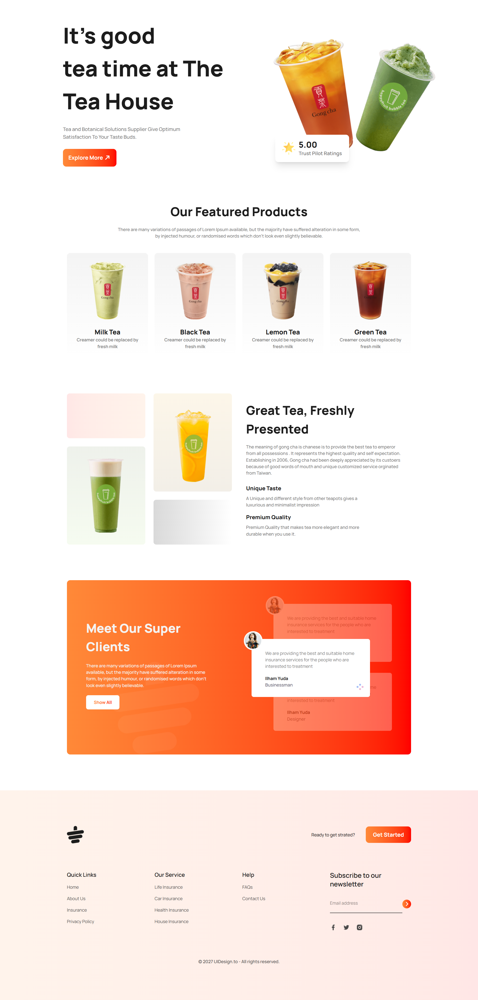

# Tea House

A simple tea house landing page that I built while learning frontend development. This project helped me practice creating a clean website layout using HTML and Tailwind CSS.

## Features

* Hero/banner section
* Featured tea selection
* Tea products section
* Customer reviews
* Contact/newsletter section
* Footer

## Technologies Used

* HTML5
* Tailwind CSS
* CSS3

## Live Website

[View Live Website](https://fahmidaaktershimu.github.io/Tea-House)

## Desktop View

> Add a screenshot of the desktop view to the `images` folder and name it `desktop-view.png`.

## What I Learned

* Structuring a landing page with HTML
* Building layouts with Tailwind CSS
* Working with images and reusable sections
* Improving my understanding of frontend layout and styling

### GitHub: [FahmidaAkterShimu](https://github.com/FahmidaAkterShimu)
